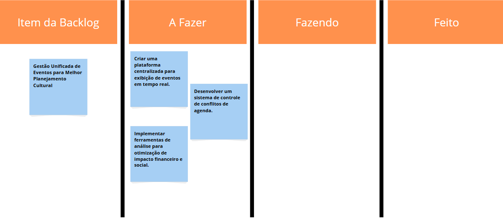
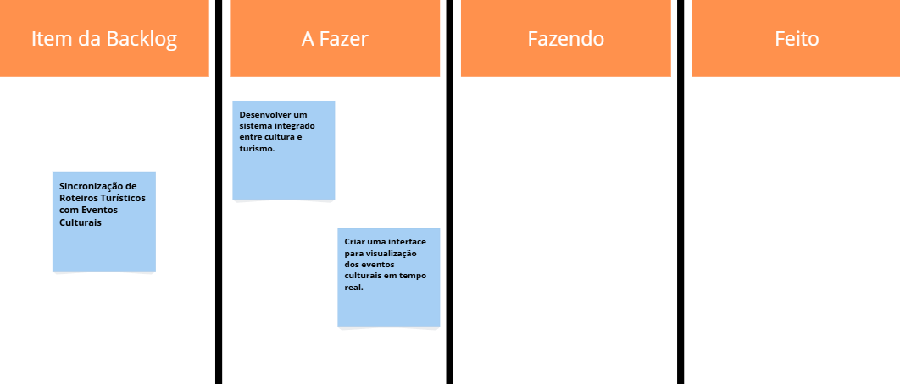
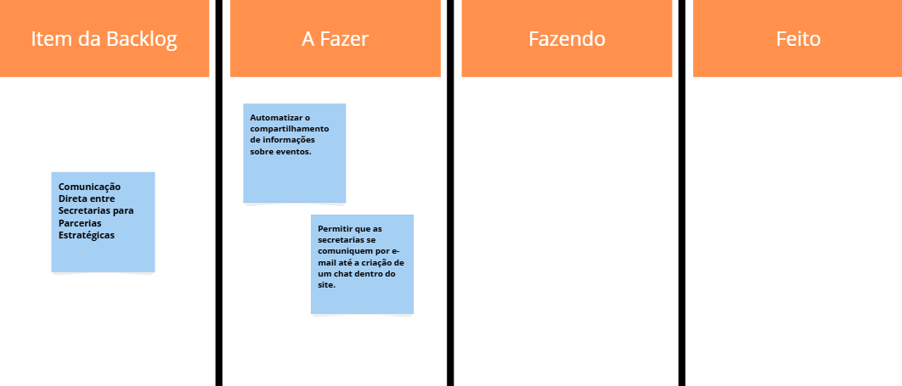
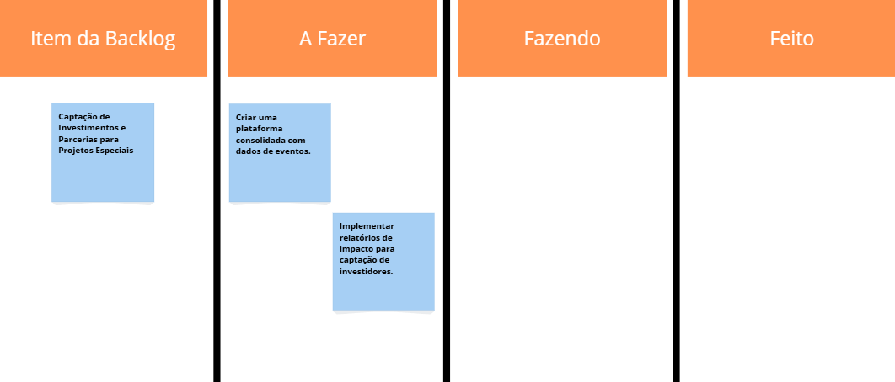
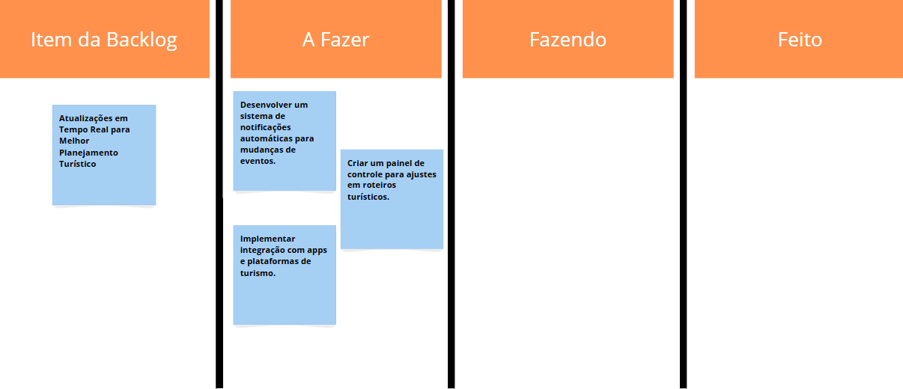
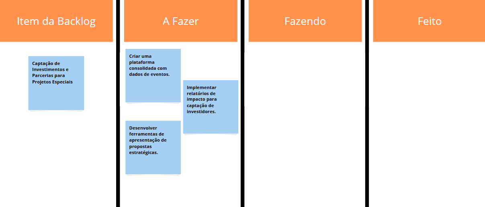
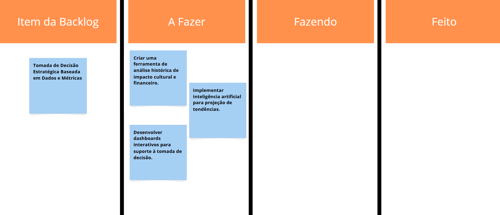
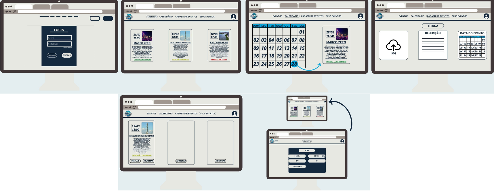
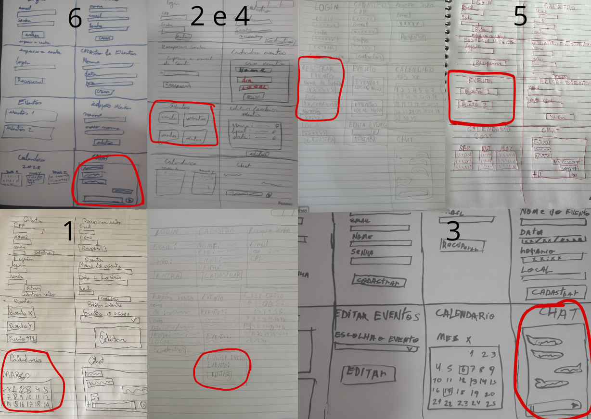

  

# CulturaConectaREC

O CulturaConecta REC é uma plataforma desenvolvida para integrar e facilitar a comunicação entre as Secretarias de Cultura e Turismo do Recife. Nosso objetivo é otimizar o planejamento de eventos, evitando conflitos de agenda e garantindo uma coordenação eficiente entre as equipes.
Acreditamos que a cultura e o turismo são forças complementares que impulsionam o desenvolvimento da cidade. Por isso, oferecemos uma ferramenta intuitiva e segura para que gestores e organizadores possam trabalhar em conjunto, promovendo experiências inesquecíveis para moradores e visitantes.
Com o CulturaConecta REC, Recife se torna ainda mais vibrante e acessível, potencializando sua riqueza cultural e fortalecendo seu turismo.

## 📋 Backlog 
📌 **Backlog:**  

1. Gestão Unificada de Eventos para Melhor Planejamento Cultural                                                                                                                                                                                                                
*Como* João, gestor cultural da Secretaria de Cultura, *Quero* acessar uma plataforma centralizada onde todos os eventos culturais e turísticos planejados na cidade sejam exibidos em tempo real, *Para que* eu possa coordenar melhor a agenda cultural, evitar conflitos de datas entre eventos importantes e otimizar o impacto financeiro e social das iniciativas culturais. Atualmente, a falta de um canal único de informação dificulta a organização dos eventos, resultando em sobreposição de programações e baixa adesão do público. Com essa solução, consigo alinhar os cronogramas de forma estratégica e garantir que cada evento receba a devida atenção.
  

2. Sincronização de Roteiros Turísticos com Eventos Culturais                                                                                                                                                                                                                   
*Como* Carlos, coordenador de turismo da Secretaria de Turismo, *Quero* um sistema integrado que exiba os eventos culturais planejados na cidade, *Para que* eu possa incluir esses eventos nos roteiros turísticos e oferecer experiências mais ricas e atrativas para visitantes. Atualmente, tenho dificuldade em obter informações atualizadas sobre eventos organizados por outras secretarias, o que prejudica a criação de roteiros turísticos dinâmicos e atrativos. Com esse sistema, posso visualizar de forma clara quais eventos podem agregar valor às rotas turísticas e planejar estratégias que aumentem o fluxo de turistas na cidade.
  

3. Comunicação Direta entre Secretarias para Parcerias Estratégicas                                                                                                                                                                                                             
*Como* Fernanda, assessora técnica da Secretaria de Turismo, *Quero* um canal de comunicação ágil e direto entre a Secretaria de Turismo e a Secretaria de Cultura, *Para que* eu possa alinhar ações, sugerir parcerias estratégicas e colaborar na organização de eventos que possam ser promovidos no setor turístico. Atualmente, o contato entre secretarias é burocrático e demorado, o que dificulta o aproveitamento máximo das oportunidades de integração entre cultura e turismo. Com um canal eficiente, posso sugerir colaborações em tempo hábil, promovendo eventos de maneira mais coordenada e estratégica.
  

4. Banco de Dados Centralizado para Divulgação Eficiente                                                                                                                                                                                                                        
*Como* Mariana, analista de marketing da prefeitura, *Quero* um banco de dados atualizado e acessível, contendo todas as informações essenciais sobre eventos organizados pela prefeitura, *Para que* eu possa garantir uma divulgação eficiente, evitar atrasos na publicação de informações e minimizar erros causados pela descentralização de dados. Atualmente, preciso buscar detalhes de eventos em diferentes setores, o que consome tempo e prejudica a agilidade da comunicação. Com essa solução, posso atualizar rapidamente o site e as redes sociais oficiais, garantindo que o público tenha acesso a informações precisas e em tempo real.
  

5. Relatórios de Impacto Cultural e Econômico para Otimizar Investimentos                                                                                                                                                                                                       
*Como* Eduardo, diretor de planejamento da Secretaria de Cultura, *Quero* acessar relatórios detalhados sobre o impacto econômico e social dos eventos culturais da cidade, *Para que* eu possa justificar investimentos, otimizar recursos e definir estratégias mais eficazes para o desenvolvimento cultural local. Atualmente, a falta de dados concretos sobre a influência dos eventos na economia e na qualidade de vida dos cidadãos torna difícil a alocação inteligente de verbas. Com esses relatórios, posso avaliar quais eventos geram maior retorno e planejar futuras iniciativas culturais de forma mais embasada.
  

6. Automação da Análise Financeira e Redução da Burocracia                                                                                                                                                                                                                      
*Como* João, coordenador financeiro da prefeitura, *Quero* um sistema que organize e detalhe os custos de cada evento cultural e turístico, *Para que* eu possa aprovar orçamentos de forma mais ágil, avaliar o retorno financeiro das iniciativas e reduzir processos burocráticos desnecessários. Atualmente, a falta de transparência nos custos de eventos dificulta a tomada de decisões e pode atrasar a liberação de verbas. Com uma ferramenta automatizada, posso acessar relatórios financeiros detalhados e fazer aprovações mais rápidas e embasadas, garantindo o uso eficiente dos recursos públicos.
  

7. Atualizações em Tempo Real para Melhor Planejamento Turístico                                                                                                                                                                                                                
*Como* Carlos, coordenador de turismo da Secretaria de Turismo, *Quero* receber notificações automáticas sobre mudanças na programação de eventos, *Para que* eu possa adaptar os roteiros turísticos em tempo hábil e evitar que turistas sejam impactados por cancelamentos ou alterações inesperadas. Atualmente, a comunicação entre setores é lenta, e mudanças de última hora podem comprometer a experiência dos visitantes. Com esse sistema de notificações, posso ajustar os roteiros rapidamente, garantindo que os turistas aproveitem ao máximo sua estadia na cidade.
  

8. Captação de Investimentos e Parcerias para Projetos Especiais                                                                                                                                                                                                                
*Como* Luciana, secretária executiva de projetos especiais do Gabinete do Prefeito, *Quero* acessar uma plataforma consolidada com dados organizados sobre os eventos da cidade, incluindo seu impacto econômico e social, *Para que* eu possa apresentar propostas detalhadas e embasadas a investidores e patrocinadores, aumentando as chances de captação de recursos. Atualmente, a falta de informações quantitativas e qualitativas sobre os eventos dificulta a negociação com empresas e parceiros estratégicos. Com essa solução, posso demonstrar de forma clara o valor dos projetos e atrair mais investimentos para a cultura e o turismo da cidade.
  

9. Prevenção de Conflitos de Agenda e Maximização do Público                                                                                                                                                                                                                    
*Como* João, gestor cultural da Secretaria de Cultura, *Quero* um sistema de alertas automáticos que identifique conflitos de agenda entre eventos de grande porte, *Para que* eu possa reorganizar os cronogramas e evitar competições desnecessárias pelo público, maximizando o alcance e o impacto de cada evento. Atualmente, a falta de um controle eficiente faz com que eventos importantes ocorram simultaneamente, dividindo o público e reduzindo o retorno financeiro e cultural. Com essa ferramenta, posso planejar melhor os calendários e garantir que cada evento receba o destaque que merece.
  

10. Tomada de Decisão Estratégica Baseada em Dados e Métricas                                                                                                                                                                                                                   
*Como* Eduardo, diretor de planejamento da Secretaria de Cultura, *Quero* uma ferramenta de análise que forneça insights sobre o impacto cultural e financeiro dos eventos ao longo dos anos, *Para que* eu possa tomar decisões estratégicas mais informadas e garantir o crescimento sustentável da cultura na cidade. Atualmente, a falta de dados históricos e previsões dificulta a criação de planos de longo prazo. Com essa solução, posso entender quais tipos de eventos têm maior impacto, onde devemos investir mais e como alinhar a política cultural da cidade às necessidades da população e do setor turístico.
  

## 🎨 Sketches e Storyboards  
📌 **Storyboard:**

📌 **Sketche:**  

  

## 🎥 Apresentação em Vídeo  
📌 **Screencast demonstrando o protótipo:**  
 

## Contribuidores

Matheus Barkokebas - mbbc@cesar.school

Tiago Abraão - taol@cesar.school

João Neri - jgsn@cesar.school

Gabriel Guedes - gpg3@cesar.school

Luiz Eduardo - lemm@cesar.school

Pedro Pessoa - ppb2@cesar.school

Lucas Canto - lcss@cesar.school
