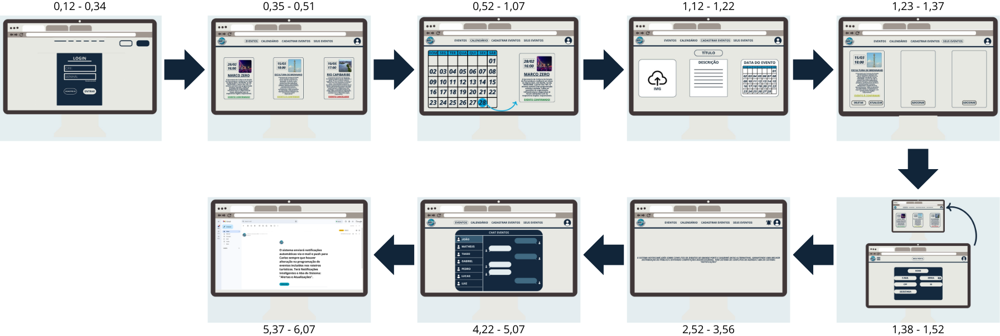
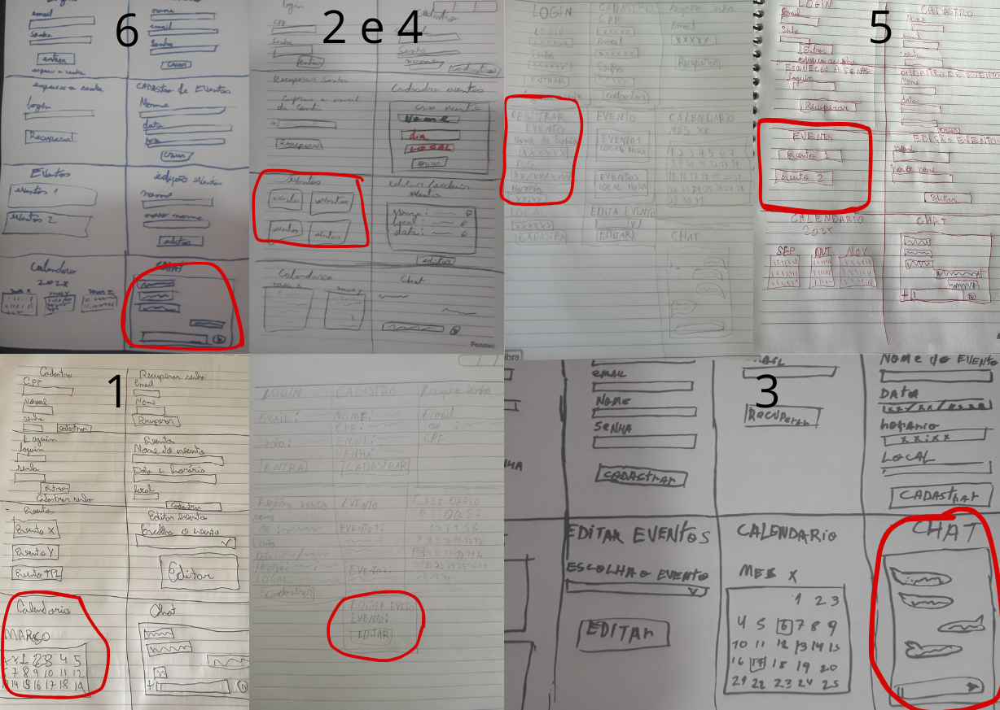
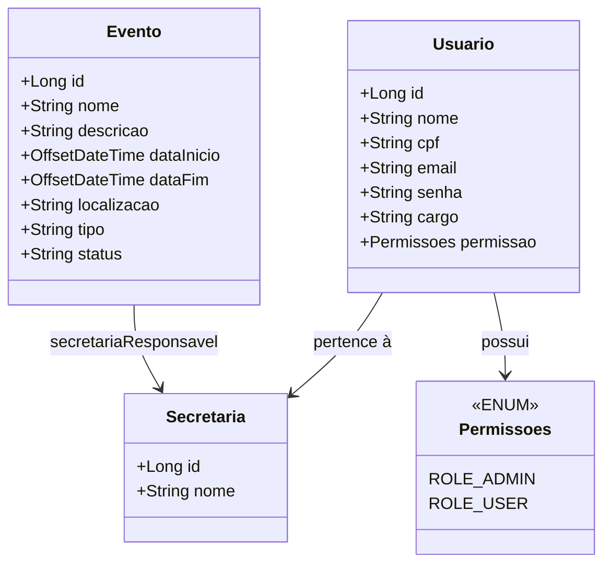

  

# CulturaConectaREC

O CulturaConecta REC é uma plataforma desenvolvida para integrar e facilitar a comunicação entre as Secretarias de Cultura e Turismo do Recife. Nosso objetivo é otimizar o planejamento de eventos, evitando conflitos de agenda e garantindo uma coordenação eficiente entre as equipes.
Acreditamos que a cultura e o turismo são forças complementares que impulsionam o desenvolvimento da cidade. Por isso, oferecemos uma ferramenta intuitiva e segura para que gestores e organizadores possam trabalhar em conjunto, promovendo experiências inesquecíveis para moradores e visitantes.
Com o CulturaConecta REC, Recife se torna ainda mais vibrante e acessível, potencializando sua riqueza cultural e fortalecendo seu turismo. <a href="https://trello.com/invite/b/67edc68a1f86e3f7160b0399/ATTIe4a7a7f885745a65c1b27b3a1a30a42dF6BB598D/conectaculturarec" target="_blank">Link do Trello</a>

## 📋 Backlog 
📌 **Backlog:**  

 
    
1. Gestão Unificada de Eventos para Melhor Planejamento Cultural

- *Como* João, gestor cultural da Secretaria de Cultura, *Quero* acessar uma plataforma centralizada onde todos os eventos culturais e turísticos planejados na cidade sejam exibidos em tempo real, *Para que* eu possa coordenar melhor a agenda cultural, evitar conflitos de datas entre eventos importantes e otimizar o impacto financeiro e social das iniciativas culturais. Atualmente, a falta de um canal único de informação dificulta a organização dos eventos, resultando em sobreposição de programações e baixa adesão do público. Com essa solução, consigo alinhar os cronogramas de forma estratégica e garantir que cada evento receba a devida atenção.
  

 
    
2. Sincronização de Roteiros Turísticos com Eventos Culturais 

- *Como* Carlos, coordenador de turismo da Secretaria de Turismo, *Quero* um sistema integrado que exiba os eventos culturais planejados na cidade, *Para que* eu possa incluir esses eventos nos roteiros turísticos e oferecer experiências mais ricas e atrativas para visitantes. Atualmente, tenho dificuldade em obter informações atualizadas sobre eventos organizados por outras secretarias, o que prejudica a criação de roteiros turísticos dinâmicos e atrativos. Com esse sistema, posso visualizar de forma clara quais eventos podem agregar valor às rotas turísticas e planejar estratégias que aumentem o fluxo de turistas na cidade.
   

 
    
3. Comunicação Direta entre Secretarias para Parcerias Estratégicas 

- *Como* Fernanda, assessora técnica da Secretaria de Turismo, *Quero* um canal de comunicação ágil e direto entre a Secretaria de Turismo e a Secretaria de Cultura, *Para que* eu possa alinhar ações, sugerir parcerias estratégicas e colaborar na organização de eventos que possam ser promovidos no setor turístico. Atualmente, o contato entre secretarias é burocrático e demorado, o que dificulta o aproveitamento máximo das oportunidades de integração entre cultura e turismo. Com um canal eficiente, posso sugerir colaborações em tempo hábil, promovendo eventos de maneira mais coordenada e estratégica.
   

 
    
4. Acesso Privilegiado a Informações para Divulgação Eficiente

- *Como* Mariana, analista de marketing da prefeitura, *Quero* ter acesso a uma aba exclusiva dentro do sistema, onde todas as informações essenciais sobre eventos organizados pela prefeitura estejam disponíveis, *Para que* eu possa garantir uma divulgação eficiente, evitar atrasos na publicação de informações e minimizar erros causados pela descentralização de dados. Atualmente, preciso buscar detalhes de eventos em diferentes setores, o que consome tempo e prejudica a agilidade da comunicação. Com essa solução, posso atualizar rapidamente o site e as redes sociais oficiais, garantindo que o público tenha acesso a informações precisas e em tempo real.
   

 
    
5. Atualizações em Tempo Real para Melhor Planejamento Turístico 

- *Como* Carlos, coordenador de turismo da Secretaria de Turismo, *Quero* receber notificações automáticas sobre mudanças na programação de eventos, *Para que* eu possa adaptar os roteiros turísticos em tempo hábil e evitar que turistas sejam impactados por cancelamentos ou alterações inesperadas. Atualmente, a comunicação entre setores é lenta, e mudanças de última hora podem comprometer a experiência dos visitantes. Com esse sistema de notificações, posso ajustar os roteiros rapidamente, garantindo que os turistas aproveitem ao máximo sua estadia na cidade.
    

 
    
6. Prevenção de Conflitos de Agenda e Maximização do Público

- *Como* João, gestor cultural da Secretaria de Cultura, *Quero* um sistema de alertas automáticos que identifique conflitos de agenda entre eventos de grande porte, *Para que* eu possa reorganizar os cronogramas e evitar competições desnecessárias pelo público, maximizando o alcance e o impacto de cada evento. Atualmente, a falta de um controle eficiente faz com que eventos importantes ocorram simultaneamente, dividindo o público e reduzindo o retorno financeiro e cultural. Com essa ferramenta, posso planejar melhor os calendários e garantir que cada evento receba o destaque que merece.
      

## 🎨 Sketches e Storyboards  
📌 **Storyboard:**

📌 **Sketche:**  

  

## 🎥 Apresentação em Vídeo  
📌 **Screencast demonstrando o protótipo:**  
<a href="https://youtu.be/lI1i66PZlaw" target="_blank">Link do Vídeo do Protótipo</a>

## DIAGRAMAS
### 📌 Diagrama de Classes

### 📌 Diagrama de Atividades

## Programação em PAR
**Front-end**
Usar programação em par no front-end melhora a qualidade visual e a usabilidade do produto, pois dois desenvolvedores podem validar juntos a experiência do usuário, identificar inconsistências de design e otimizar a responsividade de forma mais eficiente.

**Back-end:**
No back-end, a programação em par ajuda a construir sistemas mais robustos e seguros, permitindo que erros de lógica, falhas de performance e problemas de arquitetura sejam detectados e corrigidos rapidamente com a colaboração de dois desenvolvedores.

## Contribuidores

Matheus Barkokebas - mbbc@cesar.school

Tiago Abraão - taol@cesar.school

João Neri - jgsn@cesar.school

Gabriel Guedes - gpg3@cesar.school

Luiz Eduardo - lemm@cesar.school

Pedro Pessoa - ppb2@cesar.school

Lucas Canto - lcss@cesar.school

Lucas Nery Sereno - lns3@cesar.school
