  

# CulturaConectaREC

O CulturaConecta REC é uma plataforma desenvolvida para integrar e facilitar a comunicação entre as Secretarias de Cultura e Turismo do Recife. Nosso objetivo é otimizar o planejamento de eventos, evitando conflitos de agenda e garantindo uma coordenação eficiente entre as equipes.
Acreditamos que a cultura e o turismo são forças complementares que impulsionam o desenvolvimento da cidade. Por isso, oferecemos uma ferramenta intuitiva e segura para que gestores e organizadores possam trabalhar em conjunto, promovendo experiências inesquecíveis para moradores e visitantes.
Com o CulturaConecta REC, Recife se torna ainda mais vibrante e acessível, potencializando sua riqueza cultural e fortalecendo seu turismo. 

## 📋 Backlog 

<a href="https://trello.com/invite/b/67edc68a1f86e3f7160b0399/ATTIe4a7a7f885745a65c1b27b3a1a30a42dF6BB598D/conectaculturarec" target="_blank">📌 Link do Backlog (Trello)</a>

## 🎨 Sketches e Storyboards  

 
    
📌 Storyboard

    

 
    
📌 Sketch

    
  

## 🎥 Apresentação em Vídeo  
📌 **Screencast demonstrando o protótipo:**  
<a href="https://youtu.be/lI1i66PZlaw" target="_blank">- Screecast do Protótipo</a>  
<a href="https://youtu.be/29PlBoQNA0k" target="_blank">- Screecast final</a>

## 👥 Programação em Par

 
    
Evidência 1

    
  

 
    
Evidência 2

    
  

## DIAGRAMAS
### 📌 Diagrama de Classes

### 📌 Diagrama de Atividades

```mermaid
flowchart LR
    A([Início]) --> B[Tela de Login]
    B --> C{Login realizado?}
    C -- Não --> B
    C -- Sim --> D[Verificar Permissões]

    D --> E{Tipo de Permissão}
    
    E -- Admin --> F[Área Admin]
    E -- User --> G[Área Usuário]

    %% Fluxo do Admin
    F --> F1[Gerenciar Usuários]
    F1 --> F1a[Criar Usuário]
    F1 --> F1b[Editar Usuário]
    F1 --> F1c[Deletar Usuário]

    F --> F2[Gerenciar Secretarias]
    F2 --> F2a[Criar Secretaria]
    F2 --> F2b[Editar Secretaria]
    F2 --> F2c[Deletar Secretaria]

    F --> F3[Gerenciar Eventos]
    F3 --> F3a[Criar Evento]
    F3 --> F3b[Editar Evento]
    F3 --> F3c[Deletar Evento]

    F --> F4[Visualizar Calendário Interativo]

    %% Fluxo do Usuário
    G --> G1[Visualizar Eventos]
    G --> G2[Visualizar Calendário Interativo]

    %% Logout disponível em todas as áreas
    F1a --> H[Logout]
    F1b --> H
    F1c --> H
    F2a --> H
    F2b --> H
    F2c --> H
    F3a --> H
    F3b --> H
    F3c --> H
    F4 --> H
    G1 --> H
    G2 --> H

    H --> I((Fim))

    %% Estilos de cor
    style A fill:#9fdf9f,stroke:#333,stroke-width:2px,color:#000
    style I fill:#ff9999,stroke:#333,stroke-width:2px,color:#000
    style F fill:#66b3ff,stroke:#333,stroke-width:2px,color:#000
    style G fill:#ffcc66,stroke:#333,stroke-width:2px,color:#000
    style H fill:#cccccc,stroke:#333,stroke-width:2px,color:#000
```

## Contribuidores

Matheus Barkokebas - mbbc@cesar.school

Tiago Abraão - taol@cesar.school

João Neri - jgsn@cesar.school

Gabriel Guedes - gpg3@cesar.school

Luiz Eduardo - lemm@cesar.school

Pedro Pessoa - ppb2@cesar.school

Lucas Canto - lcss@cesar.school

Lucas Nery Sereno - lns3@cesar.school
