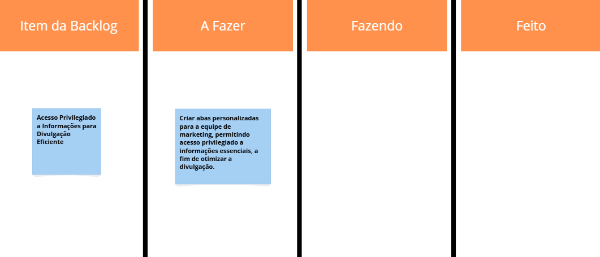
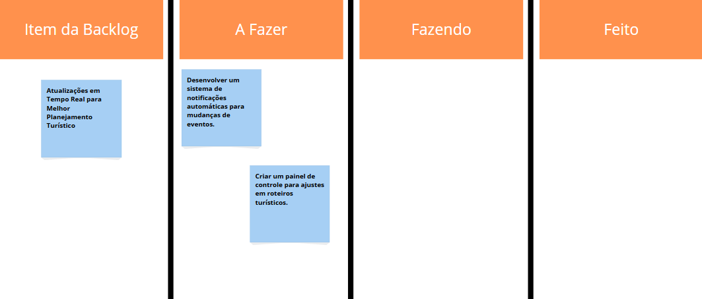
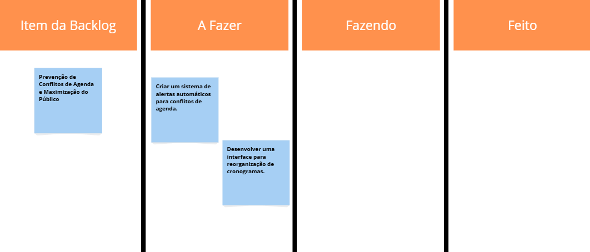

  

# CulturaConectaREC

O CulturaConecta REC é uma plataforma desenvolvida para integrar e facilitar a comunicação entre as Secretarias de Cultura e Turismo do Recife. Nosso objetivo é otimizar o planejamento de eventos, evitando conflitos de agenda e garantindo uma coordenação eficiente entre as equipes.
Acreditamos que a cultura e o turismo são forças complementares que impulsionam o desenvolvimento da cidade. Por isso, oferecemos uma ferramenta intuitiva e segura para que gestores e organizadores possam trabalhar em conjunto, promovendo experiências inesquecíveis para moradores e visitantes.
Com o CulturaConecta REC, Recife se torna ainda mais vibrante e acessível, potencializando sua riqueza cultural e fortalecendo seu turismo.

## 📋 Backlog 
📌 **Backlog:**  

  
  
  
  
  
  
  
  
  
  

## 🎨 Sketches e Storyboards  
📌 **Link para Storyboards:** [Storyboards CulturaConectaREC](link_aqui)  

📌 **Sketche:**  

  

## 🎥 Apresentação em Vídeo  
📌 **Screencast demonstrando o protótipo:**  
 

## Contribuidores

Matheus Barkokebas - mbbc@cesar.school

Tiago Abraão - taol@cesar.school

João Neri - jgsn@cesar.school

Gabriel Guedes - gpg3@cesar.school

Luiz Eduardo - @cesar.school

Pedro Pessoa - @cesar.school

Lucas Canto - @cesar.school
